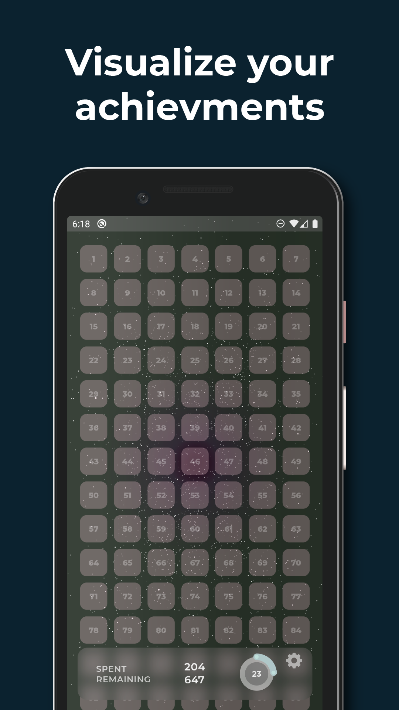
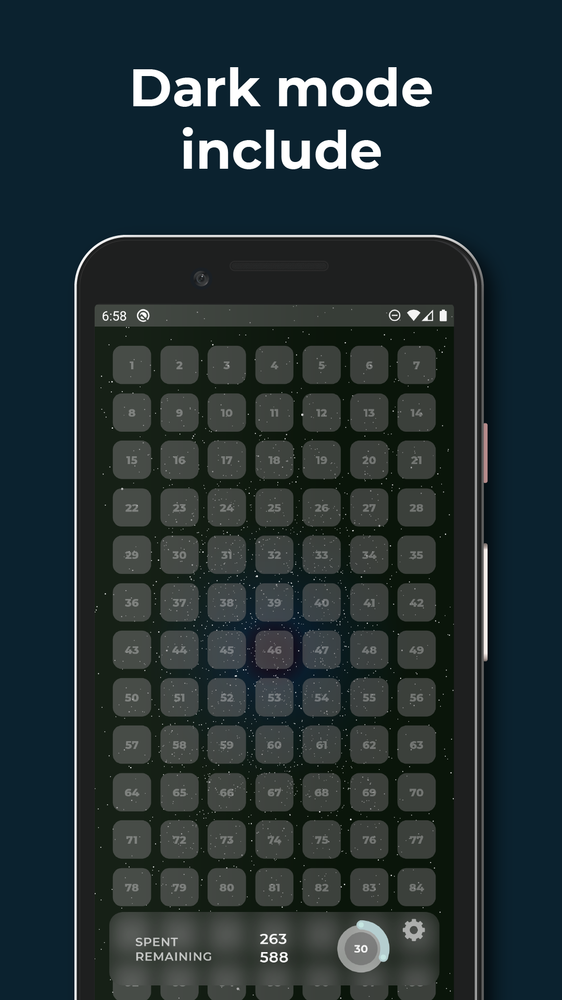
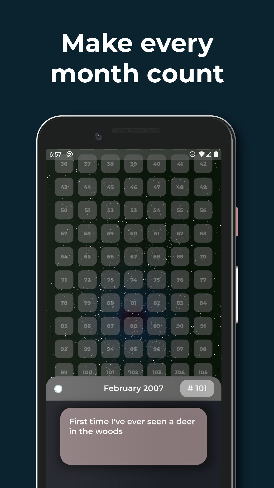

# Remaining Lifetime

**Make every month count.**

Remaining Lifetime allows you to visualize your entire life and motivates you to make every month count. Set your day of birth to create a grid of all your months on this planet, whether they are already spent or forthcoming. Set one goal each month and try to occupy all of your available tiles.

Start your journey today with Remaining Lifetime.

Now available on the Play Store.

<a href='https://play.google.com/store/apps/details?id=com.litlifesoftware.remaining_lifetime'></a>

## Screenshots

| Visualize your achievements                                                           | Dark mode included                                                                    | Make every month count                                                                |
| ------------------------------------------------------------------------------------- | ------------------------------------------------------------------------------------- | ------------------------------------------------------------------------------------- |
|  |  |  |

## Build from Source

To build this project Flutter should be installed on your computer. Visit the [install guide](https://flutter.io/docs/get-started/install) available on the Flutter website to get started.

Clone the repository and run the app using the Flutter Engine on your local device:

```bash
git clone https://github.com/litlifesoftware/remaining_lifetime.git
cd remaining_lifetime
flutter run
```

## Getting Started

For help getting started with Flutter, view Flutter's
[online documentation](https://flutter.dev/docs), which offers tutorials,
samples, guidance on mobile development, and a full API reference.

## Signing

In order to create signed APK files to upload to various app stores, you have to specify a keystore location inside the `android\key.properties` file. This file should link to a keystore stored on your local hard drive. Follow [Flutter's deployment guidelines](https://flutter.dev/docs/deployment/android#create-a-keystore) to create your own keystore required to generate verified APK files. Keystores are generated using Java's built-in library. You can generate the JSK files using [Android Studio](https://developer.android.com/studio/publish/app-signing#generate-key). Visit Oracle's Java documentation for a [step-by-step tutorial](https://docs.oracle.com/cd/E19509-01/820-3503/ggfen/index.html).

If you are using Windows and you are working with a working directory on your desktop, your `keystore.properties` file might look similar like this:

```properties
storePassword=YOUR_STORE_PASSWORD
keyPassword=YOUR_KEY_PASSWORD
keyAlias=key
# Set the storeFile path to the current work directory
storeFile=C:\\Users\\Username\\Desktop\\Flutter Working Copy\\Android Keystore\\your_keystore.jks
```

And if you are using Linux-based systems, your `keystore.properties` file might look like this:

```properties
storePassword=YOUR_STORE_PASSWORD
keyPassword=YOUR_KEY_PASSWORD
keyAlias=key
# Set the storeFile path to the current work directory
storeFile=/home/username/Desktop/Flutter\ Working\ Copy/Android\ Keystore/your_keystore.jks
```

Though it's recommended, keep in mind that signing your binaries is not required to run them on your device. You can use the debug build configuration for developing and testing this app. Or you can restore the `build.gradle` file to the default configuration if you don't want to ship signed release binaries.

## Localization

This app is currently localized in:

- `English`
- `German`
- `Russian`

## Status

Remaining Lifetime is now available on Google Play. Production binaries/APKs are also available on the [Release Section](https://github.com/litlifesoftware/RemainingLifetime/releases). Additional features are coming in next releases.

## Dependencies

Remaining Lifetime uses the following Dart dependencies in order to implement certain
features and functionality:

- [lit_ui_kit](https://pub.dev/packages/lit_ui_kit) - [License](https://github.com/dart-lang/intl/blob/master/LICENSE)
  > LitUIKit enables you to create unique user interfaces in less time. [More information](https://pub.dev/packages/lit_ui_kit)
- [lit_starfield](https://pub.dev/packages/lit_starfield) - [License](https://github.com/dart-lang/intl/blob/master/LICENSE)
  > LitStarfield enables you to render an animated starfield to be used as a background for your parent widget. [More information](https://pub.dev/packages/lit_ui_kit)
- [intl](https://pub.dev/packages/intl) - [License](https://github.com/dart-lang/intl/blob/master/LICENSE) (Used for localization)
- [package_info](https://pub.dev/packages/package_info) - [License](https://github.com/flutter/plugins/blob/master/LICENSE) (Used to detect the platform)
- [url_launcher](https://pub.dev/packages/url_launcher) - [License](https://github.com/flutter/plugins/blob/master/packages/url_launcher/url_launcher/LICENSE) (Used to
  redirect users to websites)
- [hive](https://pub.dev/packages/hive) - [License](https://github.com/hivedb/hive/blob/master/hive/LICENSE) (Used as persistent storage)
- [hive_flutter](https://pub.dev/packages/hive_flutter) - [License](https://github.com/hivedb/hive/blob/master/hive_flutter/LICENSE) (Flutter Addon for Hive)
- [hive_generator](https://pub.dev/packages/hive_generator) - [License](https://github.com/hivedb/hive/blob/master/hive_generator/LICENSE) (Addon for Hive)
- [build_runner](https://pub.dev/packages/build_runner) - [License](https://github.com/dart-lang/build/blob/master/build_runner/LICENSE) (Used to generate Adapter classes for Hive data models)
- [flutter_launcher_icon](https://pub.dev/packages/flutter_launcher_icons) - [License](https://github.com/fluttercommunity/flutter_launcher_icons/blob/master/LICENSE) (Used to generate Android/iOS Launcher Icons)

## License

Google Play and the Google Play logo are trademarks of Google Inc.

All images in the `assets/images` folder are licensed under the **CC-BY**.

Everything else in this repository including the source code is distributed under the
**BSD 3-Clause** license as specified in the `LICENSE` file.
