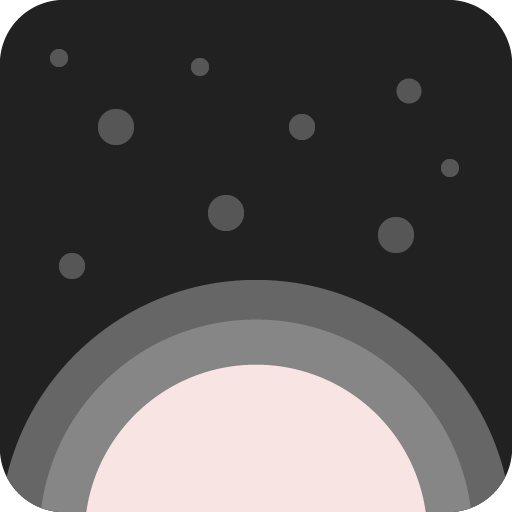

# Remaining Lifetime



Remaining Lifetime allows you to visualize your entire life and motivates you to make every month count. Set your day of birth to create a grid of all your months on this planet, whether they are already spent or forthcoming. Set one goal each month and try to occupy all of your available tiles.

Start your journey today with Remaining Lifetime.

Visit our [website](https://litlifesoftware.github.io) for more details.

Created and maintained by [LitLifeSoftware](https://litlifesoftware.github.io/) (Michael Grigorenko).

## Getting Started

To build this project Flutter should be installed on your computer. Visit the [install guide](https://flutter.io/docs/get-started/install) available on the Flutter website to get started.

```
git clone https://github.com/litlifesoftware/remaining_lifetime.git
cd remaining_lifetime
flutter run
```

For help getting started with Flutter, view Flutter's
[online documentation](https://flutter.dev/docs), which offers tutorials,
samples, guidance on mobile development, and a full API reference.

## Signature

In order to create signed APK files to upload to various app stores, you have to specify a keystore location inside the `android\key.properties` file. This file should link to a keystore stored on your local hard drive. Follow [Flutter's deployment guidelines](https://flutter.dev/docs/deployment/android#create-a-keystore) to create your own keystore required to generate verified APK files.

## Localization

There are **English**, **German** and **Russian** localizations available for this app. These strings are stored in the `assets\localization\localized_strings.json` and read on the app's start up.

## Dependencies

Remaining Lifetime uses the following Dart dependencies in order to implement certain
features and functionality:

- [lit_ui_kit](https://pub.dev/packages/lit_ui_kit) - [License](https://github.com/dart-lang/intl/blob/master/LICENSE)
  > LitUIKit enables you to create unique user interfaces in less time. [More information](https://pub.dev/packages/lit_ui_kit)
- [lit_starfield](https://pub.dev/packages/lit_starfield) - [License](https://github.com/dart-lang/intl/blob/master/LICENSE)
  > LitStarfield enables you to render an animated starfield to be used as a background for your parent widget. [More information](https://pub.dev/packages/lit_ui_kit)
- [intl](https://pub.dev/packages/intl) - [License](https://github.com/dart-lang/intl/blob/master/LICENSE) (Used for localization)
- [package_info](https://pub.dev/packages/package_info) - [License](https://github.com/flutter/plugins/blob/master/LICENSE) (Used to detect the platform)
- [url_launcher](https://pub.dev/packages/url_launcher) - [License](https://github.com/flutter/plugins/blob/master/packages/url_launcher/url_launcher/LICENSE) (Used to
  redirect users to websites)
- [hive](https://pub.dev/packages/hive) - [License](https://github.com/hivedb/hive/blob/master/hive/LICENSE) (Used as persistent storage)
- [hive_flutter](https://pub.dev/packages/hive_flutter) - [License](https://github.com/hivedb/hive/blob/master/hive_flutter/LICENSE) (Flutter Addon for Hive)
- [hive_generator](https://pub.dev/packages/hive_generator) - [License](https://github.com/hivedb/hive/blob/master/hive_generator/LICENSE) (Addon for Hive)
- [build_runner](https://pub.dev/packages/build_runner) - [License](https://github.com/dart-lang/build/blob/master/build_runner/LICENSE) (Used to generate Adapter classes for Hive data models)
- [flutter_launcher_icon](https://pub.dev/packages/flutter_launcher_icons) - [License](https://github.com/fluttercommunity/flutter_launcher_icons/blob/master/LICENSE) (Used to generate Android/iOS Launcher Icons)

## License

All images in the `assets/images` folder are licensed under the **CC-BY**.

Everything else in this repository including the source code is distributed under the
**BSD 3-Clause** license as specified in the `LICENSE` file.

## Screenshots


